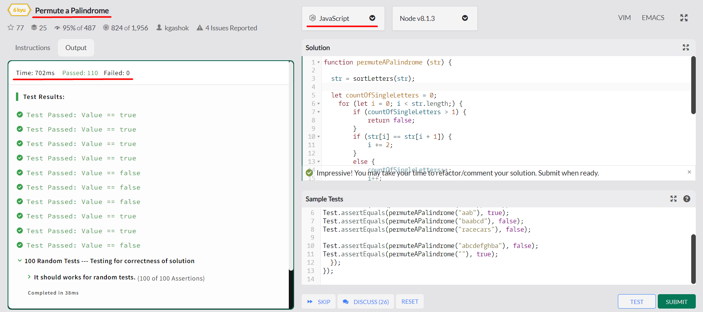
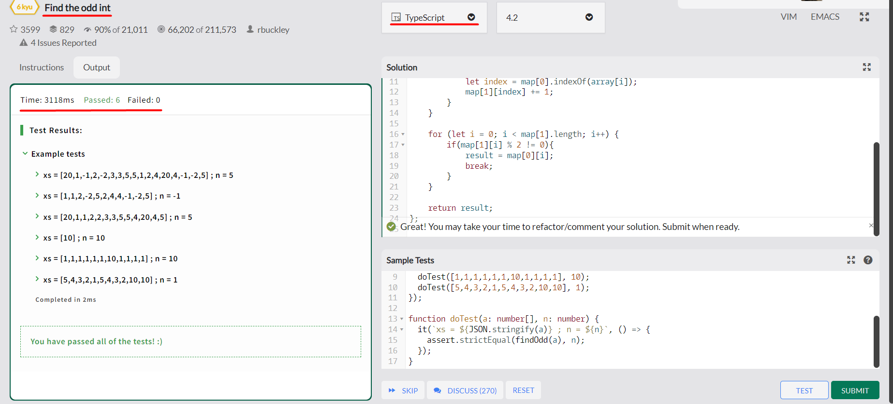
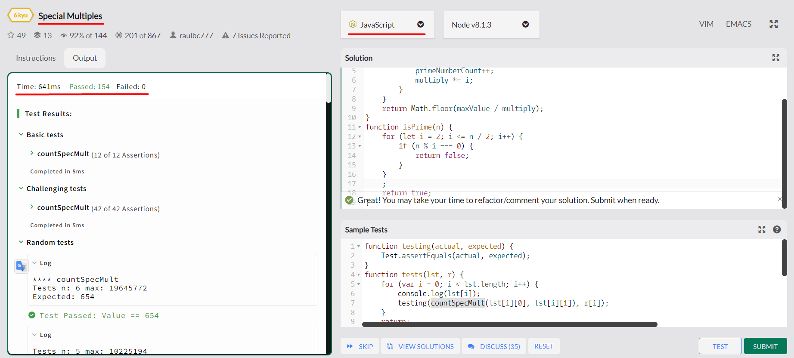
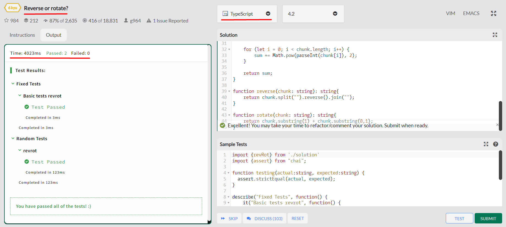

## Installation

Install NodeJS dependencies:

> npm install

## Execution

launch project:
> npm run launch

launch project with parameters:
> npm run launch -- -ps qwerty -foia 5 2 2 -smn 3 -smmv 200 -rorns 123456987654 -rorcs 6

Build project:
> npm run build 

Run project:
> npm run start

## Codewars results

### Permute a palindrome: 

### Find the odd int: 

### Special multiples: 

### Reverse or rotate:

